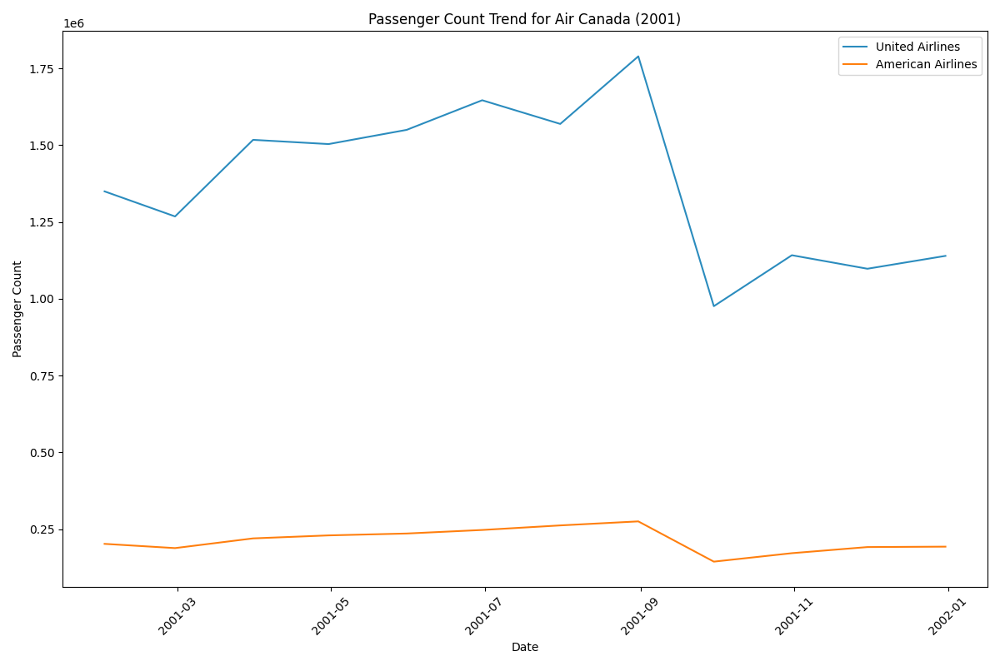

<!-- Back button -->
<button onclick="goBack()">Back</button>

This section aims to spotlight the events of September 11th, 2001, and explore the specific consequences it brought to San Francisco Airport.

On September 11th, 2001, a series of coordinated terrorist attacks occurred in the United States, resulting in the destruction of the World Trade Center in New York City, significant damage to the Pentagon near Washington, D.C., and the loss of thousands of lives. These tragic events led to immediate changes in aviation security protocols and widespread disruptions to air travel across the country, including at San Francisco Airport. Flights were grounded, security measures were intensified, and passenger confidence in air travel was significantly shaken. As a result, there was a notable decrease in air traffic activity at San Francisco Airport and airports nationwide in the days and weeks following the attacks.

As the graph shows, the impact of the 11 September (9/11) attacks varied across regions, with the United States being the most affected, as expected. The repercussions extended beyond US borders, also influencing air transport dynamics in Europe and Mexico.

However, opposite trends emerge when regions such as Central America, Canada, Asia and Australia are considered. Surprisingly, these areas did not experience a noticeable decline in air travel following the 9/11 attacks. This divergence in trends could be attributed to a number of factors, including geographical distance from the epicentre of the attacks, different levels of economic interdependence with the United States, and different travel patterns within each region.

Central America, for example, may have maintained stable air travel volumes due to its relatively limited direct connections to the US compared to other regions. Similarly, Canada's strong aviation infrastructure and diverse range of international connections may have contributed to its resilience during this period.

In contrast, regions such as Asia and Australia may have been less affected due to their greater concentration in other global markets.

<iframe src="images/area_11S.html" width="100%" height="500px"></iframe>

<strong>Figure 1:</strong> <em>Yearly evolition of Regions form 2001 until 2005</em>

Regarding the airlines directly impacted by the accident, Figure 2 highlights those most affected. The two planes involved belonged to these airlines, intensifying the repercussions for them compared to others in the industry.

<strong>Figure 2:</strong> <em>Flow of 2001 for United Airlines and American Airlines</em>

Following the 11 September attacks, significant changes in aviation security were introduced worldwide, including tighter security measures such as enhanced passenger and baggage screening, reinforced cockpit security, increased information sharing between national security agencies, enactment of aviation security legislation, deployment of aviation security officers and investments in advanced security technologies. These measures were intended to prevent similar incidents in the future and to ensure the safety of passengers and crew on commercial flights, marking a fundamental change in aviation security practices worldwide.

<!-- Back button -->
<button onclick="goBack()">Back</button>
