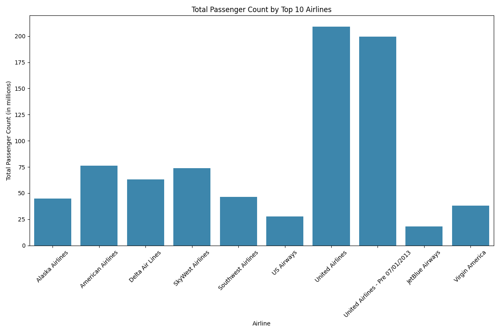

# Your Post Title

As of 2024, there are 56 different airlines operating at SFO. However, this hasn't always been the case. Delving into historical data dating back to 1999, we find that a total of 137 different airlines have operated at the airport over the years, reflecting the dynamic nature of the aviation industry.

The graph above highlights the top ten airlines in terms of passenger count from 1999 to 2024. Notably, two airlines stand out as dominant players throughout this period. It's worth noting that the apparent change in the ranking of airlines is attributed to the merger between United and Continental Airlines in 2013.

On March 31, 2013, United and Continental merged into a single entity under the name United Airlines, Inc. This strategic consolidation, with Continental operating as a wholly owned subsidiary of UAL Corporation, aimed to leverage brand equity while streamlining operations.

However, the airline landscape at SFO has witnessed more than just mergers. Some airlines, like Virgin America, merged with Alaska Airlines in 2018. Virgin America, known for its focus on low-fare, high-quality service, operated primarily on the West Coast. Similarly, US Airways, founded in 1937, ceased operations in 2015 following its merger with American Airlines.

On the other hand, some airlines have maintained a consistent presence at SFO. JetBlue Airways, although founded in 1998, began operating at SFO in 2007. In contrast, Southwest Airlines experienced a hiatus from 2001 to 2006 due to operational challenges and high airport fees. However, advancements in technology and fee reductions prompted Southwest's return to SFO in 2006.

The interactive graph below provides a visual representation of passenger count trends for the highlighted airlines:

<iframe src="images/airline_passenger_counts.html" width="100%" height="500px"></iframe>

Moreover, we can also see the seasonal fluctuations align with typical travel patterns ([Seasonal Trends in Passenger Traffic](seasons.md)), as summer months often see increased vacation travel and tourism. Conversely, February tends to experience lower travel demand due to factors such as colder weather and fewer holidays.