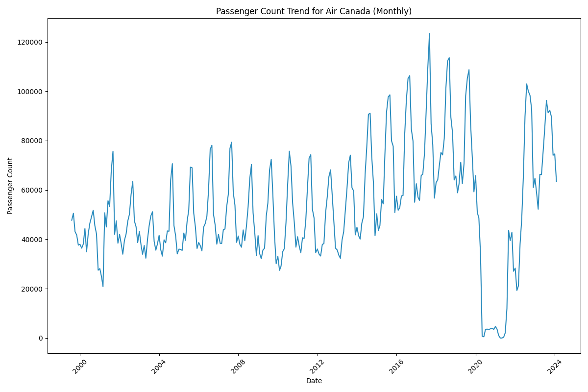

<!-- Back button -->
<button onclick="goBack()">Back</button>

# General Information

As of 2024, there are 56 different airlines operating at SFO. However, this hasn't always been the case. Delving into historical data dating back to 1999, we find that a total of 137 different airlines have operated at the airport over the years, reflecting the dynamic nature of the aviation industry.

<strong>Figure 1:</strong> <em>Top 10 Airlines in terms of passenger counts</em>

The graph in Figure 1 highlights the top ten airlines in terms of passenger count from 1999 to 2024. It highlights the top ten airlines in terms of passenger count from 1999 to 2024. There are two airlines that stand out as the dominant ones throughout this period. The merger between United and Continental Airlines in 2013 is the reason for the apparent change in the ranking of airlines.

# Airlines through history

On March 31, 2013, United and Continental merged into a single entity under the name United Airlines, Inc. This strategic consolidation, with Continental operating as a wholly owned subsidiary of UAL Corporation, aimed to leverage brand equity while streamlining operations.

However, the airline landscape at SFO has witnessed more than just mergers. Some airlines, like Virgin America, merged with Alaska Airlines in 2018. Virgin America, known for its focus on low-fare, high-quality service, operated primarily on the West Coast. Similarly, US Airways, founded in 1937, ceased operations in 2015 following its merger with American Airlines.

On the other hand, some airlines have maintained a consistent presence at SFO. JetBlue Airways, although founded in 1998, began operating at SFO in 2007. In contrast, Southwest Airlines experienced a hiatus from 2001 to 2006 due to operational challenges and high airport fees. However, advancements in technology and fee reductions prompted Southwest's return to SFO in 2006.

The interactive graph in Figure 2 provides a visual representation of passenger count trends for the highlighted airlines:

<iframe src="images/airline_passenger_counts.html" width="100%" height="430px"></iframe>

<strong>Figure 2:</strong> <em>Monthly flow of the top 10 airlines</em>

Moreover, we can also see the seasonal fluctuations align with typical travel patterns ([Temporal Evolution](temporalEvolution.md)), as summer months often see increased vacation travel and tourism. Conversely, February tends to experience lower travel demand due to factors such as colder weather and fewer holidays.

# Important Accidents

The impact of accidents on airlines can be significant, affecting not only the airline directly involved, but also the wider aviation ecosystem, including airports and other airlines. While major accidents, such as the 9/11 attacks ([11 of September](11S.md)), have had profound and lasting effects on the entire industry, individual incidents can also have significant repercussions.

In the case of San Francisco International Airport (SFO), where two Air Canada accidents occurred in 2017, there could have been repercussions for Air Canada's operations and for the airport as a whole. 

Analysis of Air Canada flight data prior to the COVID-19 pandemic reveals a slight decrease in activity, especially around the time of the accidents. While it is difficult to attribute this decline exclusively to the accidents, they may have contributed to a temporary drop in passenger demand or to operational adjustments by the airline.

<strong>Figure 3:</strong> <em>Montly flow of Air Canada airline</em>

<!-- Back button -->
<button onclick="goBack()">Back</button>
