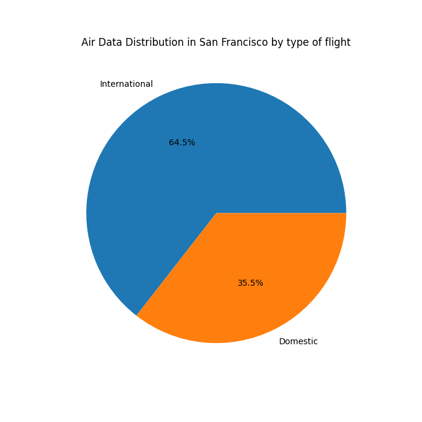

# General Analysis

The San Francisco International Airport (SFO) is one of the busiest and most iconinc airports in the United States.

In understanding the evolution of SFO, one cannot overlook the pivotal role of geographical factors. The airport's strategic location on the western coast of the United States places it at the nexus of domestic and international air travel routes.

Through the Geo Region of the flights we can understand the airport's changing significance in global air transportation networks.

The GEO Region Provides a more detailed breakdown of the GEO Summary field to designate the region in the world where activity in relation to SFO arrived from or departed to without stops

# Regions

In the upcoming bar plot, we observe the distribution of flights across various regions analyzed. Notably, the United States emerges as the region with the highest volume of flights, exceeding 12,000 over the past 25 years. Following closely is Asia, with Europe ranking third.

Despite geographical proximity potentially suggesting South America to have a higher volume of flights compared to Europe, intricate international relationships between countries reveal the opposite trend.

<iframe src="images/air_traffic_by_continent.html" width="100%" height="500px"></iframe>

This visualization breaks down flights by continent, providing insights into the global relationships established with San Francisco. It highlights the significance of each region in shaping SFO's role in the global air transportation network.

<iframe src="images/map_heatmap.html" width="100%" height="500px"></iframe>

# Relationships over time

Analyzing data from 2000 to 2023 allows us to trace the impact of significant historical events on different regions across the globe. By observing fluctuations in flight patterns during this period, we gain insights into how geopolitical, economic, and social developments have influenced air travel dynamics worldwide.

<iframe src="images/line_regions.html" width="100%" height="500px"></iframe>
Upon a quick examination of the visualization, we can identify three significant historical events.

The first is the aftermath of the September 11 attacks (11S). The US was notably affected, leading to worldwide changes in airport security protocols, resulting in a decrease in flights per year across all regions.

The second event is the Great Recession, triggering a severe global economic downturn, particularly affecting the US and Europe. Meanwhile, regions like Asia and Central America maintained relatively stable flight volumes.

Finally, the impact of COVID-19 on different regions and the subsequent travel restrictions can be observed. Further details are available in (COVID-19).

Furthermore, it's noteworthy to observe that the Middle East connection began in 2008 and continues to date. In contrast, the South America connection commenced in 2010 when San Francisco International Airport (SFO) emerged as a new gateway for travel between the United States and South America, specifically to Peru. This development likely coincided with LAN Airlines, now part of LATAM Airlines Group, introducing new non-stop flight service between SFO and Peru, offering convenient travel options for passengers between the two regions.