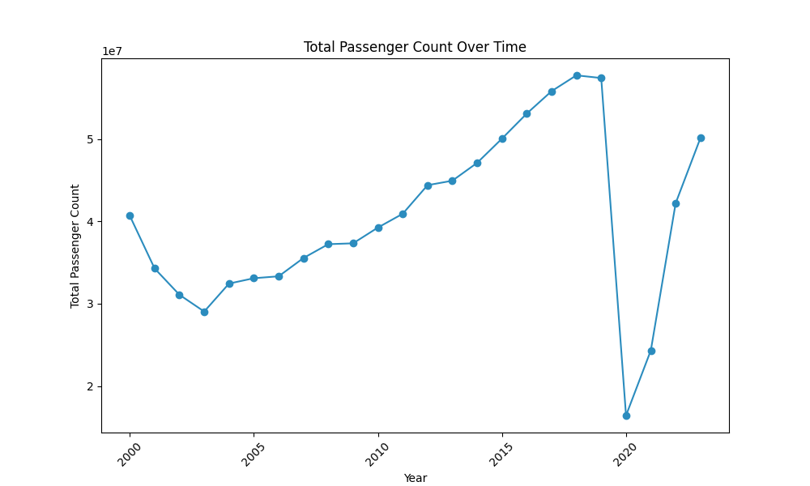

# Temporal patterns

In this section there is our exploration into San Francisco Airport's (SFO) data landscape. As one of the busiest airports in the world, SFO serves as a bustling hub connecting millions of travelers to destinations worldwide. Within this dynamic environment, understanding the temporal patterns and trends of the airport's operations gives a lot of valuable insights. Therefore, we embark on a journey through time, delving into monthly and yearly rythms. 

Our dataset holds a monthly breakdown of passenger counts from 2000 to 2023, offering a detailed look at SFO's activity over the years with three types of passengers: enplaned, deplaned, and in transit. This lets us see how passenger numbers fluctuate month by month, giving us insights into seasonal trends and travel patterns. Additionally, we've studied the evolution of these trends across the years, providing a comprehensive understanding of how passenger dynamics have evolved over the two-decade period.  Let's dive into the data and uncover the stories it tells!

## Yearly analysis
Let's first take a look upon the overarching trends in passenger activity spanning these two decades. This graph offers a panoramic view of the total passenger volume, encompassing enplaned, deplaned and in-transet people. 

The flunctuations of the amount of passengers during the years are noticeable and they happened due to different events that occured during these years. The first descense of the passenger count appears between the years 2000 and 2003, afterwards, the amount of travelers started increasing again. However, the most drastic declined happens in 2020. After researching about historical facts, different conclusions were achieved. Nevertheless, before confirm them, another yearly analysis was performed to compare the amount of the three different types of passengers stepping at SFO. 

<iframe src="images/passengers_type_yearly.html" width="100%" height="530px"></iframe>

